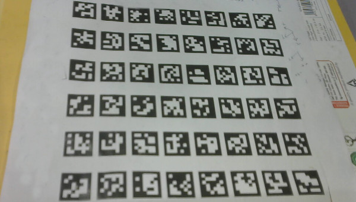
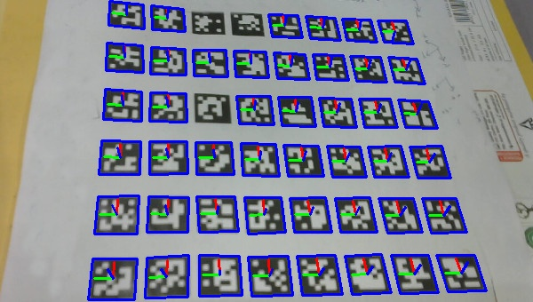

# Aruco Detector
Convert OpenCV aruco dictionaries to custom dictionaries
```bash
python3 convert_dicts.py
```
Then run test program
```bash
python3 aruco.py
```

## How It Works?

    - First, detect edges using adaptive threshold and extract corners
    - Then, convert corners to polygons using Douglas–Peucker algorithm
    - Extract patches enclosed by 4 corner polygons, and remap each patch to a rectange
    - For each such rectangle patch, divide it to grid and assign bits to each cell
    - For each bitmap, check if it is in aruco marker dictionary. Consider the pattern valid if it is present in the dictionary
  
## Sample Output
Input Image



Output Image

